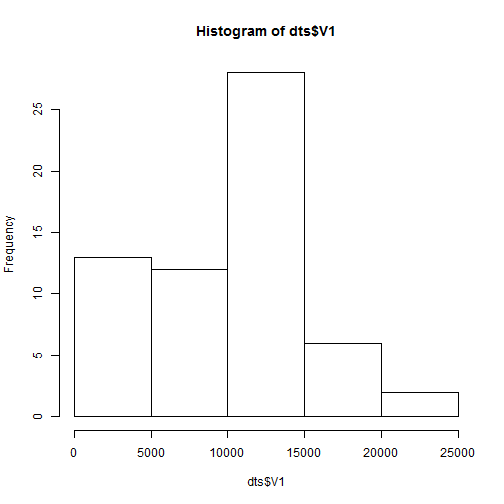
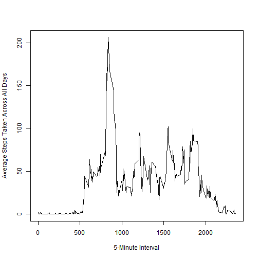
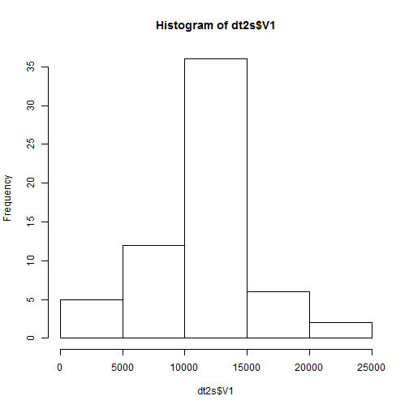
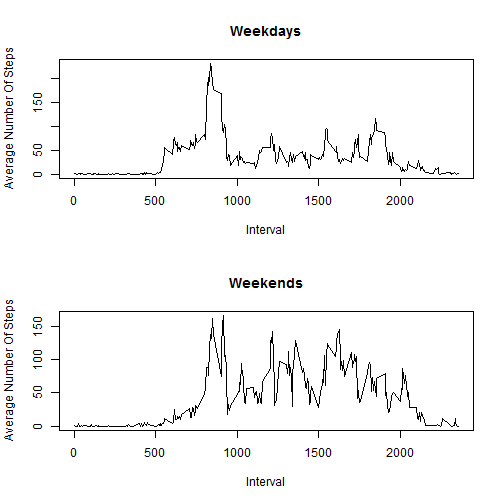

# Reproducible Research: Peer Assessment 1

## Loading and preprocessing the data
### 1.Load the data

```r
  if(!require("data.table", character.only=T)){
    install.packages("data.table")
    library(data.table)
  }
  if(!file.exists("repdata-data-activity.zip")){
  download.file(url="https://d396qusza40orc.cloudfront.net/repdata%2Fdata%2Factivity.zip",destfile="repdata-data-activity.zip")
  }
  unzip("repdata-data-activity.zip")
```
### 2.Process/transform the data (if necessary) into a format suitable for your analysis

```r
  dt<- fread(file.path(getwd(), 'activity.csv'))
  dts<-dt[,sum(steps,na.rm=TRUE),by="date"]
```
## What is mean total number of steps taken per day?
### 1.Make a histogram of the total number of steps taken each day

```r
  hist(dts$V1)
```

 
### 2.Calculate and report the mean and median total number of steps taken per day

```r
  mean(dts$V1)
```

```
## [1] 9354
```

```r
  median(dts$V1)
```

```
## [1] 10395
```

## What is the average daily activity pattern?
### 1.Make a time series plot (i.e. type = "l") of the 5-minute interval (x-axis) and the average number of steps taken, averaged across all days (y-axis)

```r
  dti<-dt[,mean(steps,na.rm=TRUE),by="interval"]
  plot(dti$interval,dti$V1,type="l",xlab="5-Minute Interval",ylab="Average Steps Taken Across All Days")
```

 
### 2.Which 5-minute interval, on average across all the days in the dataset, contains the maximum number of steps?

```r
  dti[ V1 == max(V1), interval ]
```

```
## [1] 835
```
## Imputing missing values
### 1.calculate and report the total number of missing values in the dataset (i.e. the total number of rows with NAs)

```r
  sum(is.na(dt))
```

```
## [1] 2304
```
### 2.Devise a strategy for filling in all of the missing values in the dataset. The strategy does not need to be sophisticated. For example, you could use the mean/median for that day, or the mean for that 5-minute interval, etc.

```r
  dt2<-dt[,avg:=mean(steps,na.rm=TRUE),by="interval"]
  dt2$steps[is.na(dt2$steps)]<-dt2$avg[is.na(dt2$steps)]
  dt2[,avg:=NULL]
```

```
##          steps       date interval
##     1: 1.71698 2012-10-01        0
##     2: 0.33962 2012-10-01        5
##     3: 0.13208 2012-10-01       10
##     4: 0.15094 2012-10-01       15
##     5: 0.07547 2012-10-01       20
##    ---                            
## 17564: 4.69811 2012-11-30     2335
## 17565: 3.30189 2012-11-30     2340
## 17566: 0.64151 2012-11-30     2345
## 17567: 0.22642 2012-11-30     2350
## 17568: 1.07547 2012-11-30     2355
```
### 4.Make a histogram of the total number of steps taken each day and Calculate and report the mean and median total number of steps taken per day. Do these values differ from the estimates from the first part of the assignment? What is the impact of imputing missing data on the estimates of the total daily number of steps?

```r
  dt2s<-dt2[,sum(steps,na.rm=TRUE),by="date"]
  hist(dt2s$V1)
```

 

```r
  mean(dt2s$V1)
```

```
## [1] 10766
```

```r
  median(dt2s$V1)
```

```
## [1] 10766
```
When replacing NA values with the mean of all steps per interval, we see that the total number of steps has increased. 
The new mean and median are now also the same.


## Are there differences in activity patterns between weekdays and weekends?
### 1.Create a new factor variable in the dataset with two levels - "weekday" and "weekend" indicating whether a given date is a weekday or weekend day.

```r
Sys.setlocale("LC_TIME","English")  
```

```
## [1] "English_United States.1252"
```

```r
dt2[,day:=as.factor(ifelse(weekdays(as.Date(date))=="Sunday" | weekdays(as.Date(date))=="Saturday","Weekend", "Weekday"))]
```

```
##          steps       date interval     day
##     1: 1.71698 2012-10-01        0 Weekday
##     2: 0.33962 2012-10-01        5 Weekday
##     3: 0.13208 2012-10-01       10 Weekday
##     4: 0.15094 2012-10-01       15 Weekday
##     5: 0.07547 2012-10-01       20 Weekday
##    ---                                    
## 17564: 4.69811 2012-11-30     2335 Weekday
## 17565: 3.30189 2012-11-30     2340 Weekday
## 17566: 0.64151 2012-11-30     2345 Weekday
## 17567: 0.22642 2012-11-30     2350 Weekday
## 17568: 1.07547 2012-11-30     2355 Weekday
```
### 2.Make a panel plot containing a time series plot (i.e. type = "l") of the 5-minute interval (x-axis) and the average number of steps taken, averaged across all weekday days or weekend days (y-axis).

```r
dt2i<-dt2[,round(mean(steps),digits=5),by="interval,day"]
par(mfrow = c(2, 1))
with(dt2i[dt2i$day=="Weekday"],plot(interval,V1,type="l",xlab="Interval",ylab="Average Number Of Steps",main="Weekdays"))
with(dt2i[dt2i$day=="Weekend"],plot(interval,V1,type="l",xlab="Interval",ylab="Average Number Of Steps",main="Weekends"))
```

 


